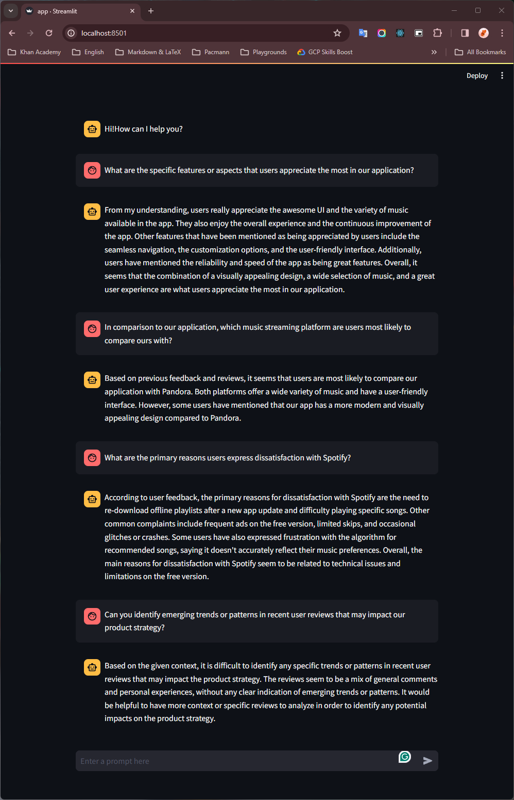

# Product Q&A ChatBot

Q&A tool to extracts meaningful information from the Google Store reviews.

## Installation

Prerequisite:
- In this case I use WSL or Ubuntu 22.04.
- Python3.10
- virtualenv

Steps:
- Create and activate virtualenv.

    ```bash
    virtualenv .venv -p /usr/bin/python3.10
    source .venv/bin/activate
    ```

- Install python packages.

    ```bash
    pip install -r requirements.txt
    ```

## Execution Pipeline

Steps:
- Load the environment variables that contains `OPENAI` and `PINECONE` credentials. Then, fill with your credentials. The example of envars were writen in `.env.example` file.
- Edit and fill `.env.example` and rename it to `.env`.
- Load the envars with `export` command.

    ```bash
    export $(grep -v '^#' .env | xargs)
    ```

- Now we can run the execution pipeline by executes the `main.py` file.

    ```bash
    python main.py
    ```

- All the configuration params are saved in `config/config.yml`
- The process will execute the other process like this order:
  - Data ingestion (Automatically download the datasets).
    - The importan params:
      - `force_ingest`: set to `True` to replace the current datasets.
  - Upsert the document (Select the useful features (column), Load the CSV as Document, Chunk the documents, Document embedding, and upsert to the Pinecone database).
    - The importan params:
      - `data_length`: to determine the length of the datasets (number of rows as documents).
      - `force_upsert`: set to `True` to replace the current documents in Pinecone.
  - Evaluation (Evaluate the LLMs Performance), *this part is already done in `notebook/10_evaluation.ipynb` but I still need time to implement it as part of the pipeline*.

## Run Application

Steps:
- Load the environment variables that contains `OPENAI` and `PINECONE` credentials. Then, fill with your credentials. The example of envars were writen in `.env.example` file.
- Edit and fill `.env.example` and rename it to `.env`.
- Load the envars with `export` command.

    ```bash
    export $(grep -v '^#' .env | xargs)
    ```

- Now we can run the execution pipeline by executes the `app.py` with streamlit.

    ```bash
    streamlit run app.py
    ```

## Screenshots

<br>
<p align="center" width="100%">
    
</p>
<br>

## Demo Videos